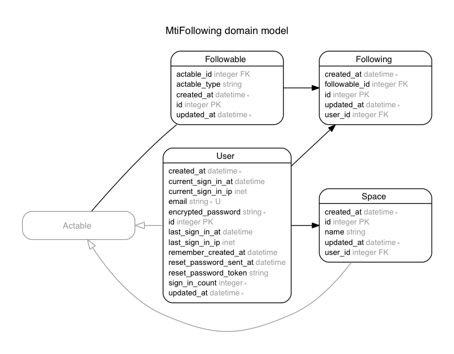

# MTI and Followings

## Use Case

- As a user, I can create spaces
- As a user, I can follow users
- As a user, I can follow spaces
- As a user, I can see my followings (spaces and users)
- As a user, I can see my followers (users)

## Details

- We use https://github.com/hzamani/active_record-acts_as
- Instances created before the set up of MTI should be added to Followable (ex: `User.first.acting_as.save`)
- If you want to add a user to your followings :
`User.first.followings.create(followable: User.last.acting_as)`
- If you want to get the first user or space followed :
`User.first.followed.first.specific`

- If you want to get all followers of an user : `User.first.followers`

## Schema

